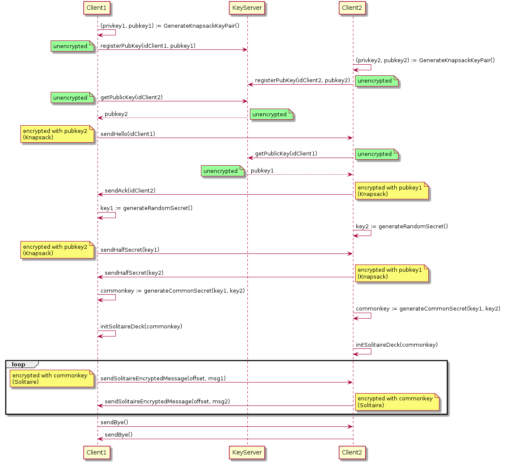

# Lab3: Knapsack + Solitaire PKI

## Prerequisites

- Create a virtual environment:

```shell
> python -m venv venv
```

- Source the virtual environment:

```shell
> source venv/bin/activate
```

- Install the dependencies:

```shell
> python -m pip install -r requirements.txt
```

- Note: the application was written in and tested with `python v3.12`.

## Running the keyserver

```shell
> python keyserver.py
```

- The keyserver listens on <localhost:9000>.

## Add the keyserver to `/etc/hosts`

- Edit your `/etc/hosts` to include the following line:

```plain
127.0.0.1   key-server
```

## Running the client(s)

- To start a client in listening mode:

```shell
> python client.py <port>
```

- To start a client which connects to a peer on startup:

```shell
> python client.py <port> <peer_port>
```

## Testing

- There are three test suites with unit tests:
  - `test_cyphers.py`
  - `test_mhknapsack.py`
  - `test_keyserver.py`

- To run a test suite:

```shell
> python <test_file>
```

- The `test_keyserver.py` suite assumes a running keyserver.

## Sequence diagram of the clients



- **Note**: the method names may differ.
